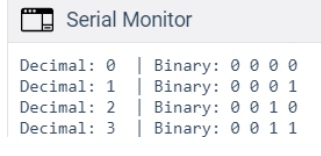

# Introduction

In today’s activity we will study how computers “count”, and we will discuss the idea of binary numbers and binary counting.

We will then connect the Arduino board to 4 LEDs, and see how the computer can count.

~~~admonish note

- The primary tool for this project will be TinkerCad -> https://www.tinkercad.com

~~~

## 1. Binary Counting

Computers count in BINARY, i.e. using ones and zeros. For example, the number 5 in binary is 101. How does this work? Here is a chart to explain how the computer uses 4-bits to represent the numbers from 0...15.

Below is a table that show the possible combinations of 4-bit binary numbers and their decimal equivalent.

|Decimal| Binary|
|---|---|
|0  | 0000  |
|1  | 0001  |
|2  | 0010  |
|3  | 0011  |
|4  | 0100  |
|5  | 0101  |
|6  | 0110  |
|7  | 0111  |
|8  | 1000  |
|9  | 1001  |
|10 | 1010  |
|11 | 1011  |
|12 | 1100  |
|13 | 1101  |
|14 | 1110  |
|15 | 1111 |

<div align=center>

**Bite binary represented here is MSB to LSB*

</div>

## 2. Converting between Decimal <---> Binary
Since binary is a base-2 system, each digit represents an increasing power of 2, with the rightmost digit representing 20 , the next representing 21, then 22, and so on. To determine the decimal representation of a binary number simply take the sum of the products of the binary digits and the powers of 2 which they represent. 

Below are some examples as reminders.

The decimal number `10' is converted to binary form like so:

<p>
   <span class="math display">
      \[
        \begin{matrix}
            2^3 & 2^2 & 2^1 & 2^0\\ \hline
            8 & 4 & 2 & 1 \\
            1 & 0 & 1 & 0
        \end{matrix}
    \]
   </span>
</p>

Alternatively you can achieve the same result this way too: 

\\[ \[(1) \cdot 2^{3}\] + \[(0) \cdot 2^{2}\] + \[(1) \cdot 2^{1}\] + \[(0) \cdot 2^{0}\] \\ \\]

\\[ 1 \cdot 8 + 0 \cdot 4 + 1 \cdot 2 + 0 \cdot 1  \\]

\\[ 1 0 1 0 \\]


So therefore decimal `10' is 1010 in binary form.

The binary number 0101 is converted to decimal form like so:

<p>
   <span class="math display">
      \[
        \begin{matrix}
            2^3 & 2^2 & 2^1 & 2^0\\ \hline
            8 & 4 & 2 & 1 \\
            0 & 1 & 0 & 1 \\
        \end{matrix}\\
         5 = 4 + 1
   \]
   </span>
</p>

Alternatively you can achieve the same result this way too: 

\\[ \[(0) \cdot 2^{3}\] + \[(1) \cdot 2^{2}\] + \[(0) \cdot 2^{1}\] + \[(1) \cdot 2^{0}\] \\ \\]

\\[ 0 \cdot 8 + 1 \cdot 4 + 0 \cdot 2 + 1 \cdot 1  \\]

\\[ 0 1 0 1 \\]

## 3. Setting up the Circuit

Once loaded login to TinkerCad and then click on \menu{Circuits > Create new Circuit}.

Change the circuit name, located top-left hand side of the screen to ``4-bit Binary Counter'', see the below image.

<div align=center>


</div>

Next you need to add an Arduino Uno and a breadboard that need to be connected together from the 5V and GND pins of the Arduino to the power and ground rails of the breadboard.

This can be achieved by either selecting the Arduino Uno and the breadboard from\ **Components** > **Basic** components or by changing **Components** > **Basic** to **Components** > **Starter** and choosing Arduino Uno and the Breadboard starter.

<div align=center>


</div>


If you have chosen the Arduino and breadboard template from the the **Components** > **Starter** then these two components are already connected with a corresponding  red 5V line and GND line. 

You now need to add:

- 4 x LED, any colour
- 4 x resistor, set at \\(0.22k\Omega\\) or \\(220\Omega\\)
- 4 x resistors, set at \\(1k\Omega\\) or \\(1000\Omega\\)
- 1 x DIP Switch SPST x 4  *use the search bar*
  
Placing components (refer to the image after the steps below):

1. Place the LEDs so that the **cathode** and **anode** is in row **18** and **19** column **e** respectively. Repeat for the next 3 LEDs in rows **(21 22), (24 25), (27 28)**.
2. . Place the resistors inline with the **Cathode** of each LED so that **terminal 2** is in column **b** and **terminal 1** in the GND rail.
3. connect a wire from inline with each **Anode** of LED, and connect from left to right of the breadboard, to **Pins 5 4 3 2** in the Arduino Uno.
4. Place the `DIP Switch SPST x 4' so that it bridges the breadboard in a horizontal position so that where number 1 is displayed the pins are on row **12** column **e**. Therefore the **O** of **On** is in row **12** column **f**.
5. Using the 4 resistors, set at \\(1k\Omega\\) or \\(1000\Omega\\), place inline with the **1 2 3 4** of the `DIP Switch SPST x 4' so that **terminal 1** of each resistor is in the GND rail and **terminal 2** is in column **d** 
6. finally, connect the `DIP Switch SPST x 4' to the Arduino Uno so that the switch positions **1,2,3,4** are wired into the pins **13,12,9,8**.
   
<div align=center>


</div>

## 4. Programming the Ciruit

1. Once you have completed the circuit you will need to programme the Arduino Uno.  Located above the **Components** click the **Code** > **Text**.

2. Once the sketch has appeared reproduce the following code: 

    ~~~admonish code

    ```C++
    void setup()
    {

    }

    void loop()
    {

    }
    ```

    ~~~

### 4.1 Global variables

1. Now you are ready to set up the Sketch up as follows. 

    ~~~admonish code

    ```C++
    int positionOne = 2;
    int positionTwo = 3;
    int positionThree = 4;
    int positionFour = 5;

    int switchOne = 13;
    int switchTwo = 12;
    int switchThree = 9;
    int switchFour = 8;

    int one;
    int two;
    int three;
    int four;
    ```

    ~~~

    ~~~admonish example title="Explanation"

    Line 1 to 4, declares the LEDs, where `positionFour` through to `positionOne` represents the \\(2^3 \Leftarrow 2^0\\).

    Line 6 to 9, declares the switches, where `switchOne` through to `switchFour` represents the \\(2^0 \Rightarrow 2^3\\).

    ~~~

2. Line 11 to 14, will store the state of each switch.

    ~~~admonish code title="Code: should look like this now" collapsible=true 

    ```C++
    int positionOne = 2;
    int positionTwo = 3;
    int positionThree = 4;
    int positionFour = 5;

    int switchOne = 13;
    int switchTwo = 12;
    int switchThree = 9;
    int switchFour = 8;

    int one;
    int two;
    int three;
    int four;

    void setup()
    {

    }

    void loop()
    {

    }
    ```
    ~~~

    ~~~admonish todo
    
    - Add inline comments for each variable to describe their purpose, using the `//` comment symbols

    ~~~

### 4.2 Void Setup

1. Now we do standard setup in the `void setup()`

    ~~~admonish code

    ```C++
    void setup()
    {
      pinMode(positionOne, OUTPUT);
      pinMode(positionTwo, OUTPUT);
      pinMode(positionThree, OUTPUT);
      pinMode(positionFour, OUTPUT);

      pinMode(switchOne, INPUT);
      pinMode(switchTwo, INPUT);
      pinMode(switchThree, INPUT);
      pinMode(switchFour, INPUT);
    }
    ```
    ~~~

    ~~~admonish example title="Explanation"

    Lines 18 to 21 set the pins to `OUTPUT` mode

    Lines 23 to 26 set the pins to `INPUT` mode

    ~~~

### 4.3 Void Loop

1. The `void loop()`, has several sections and it is broken down into manageable chunks below.

    ~~~admonish code

    ```C++
    void loop()
    {
      one = digitalRead(switchOne);
      two = digitalRead(switchTwo);
      three = digitalRead(switchThree);
      four = digitalRead(switchFour);
    ```

    ~~~

    ~~~admonish example title="Explanation"

    Lines 31 to 34, clearly shows the function `digitalRead()` function to read the pins and save the status to the variables defined earlier. 

    ~~~


    ~~~admonish todo

    - Add inline comments for each variable to describe their purpose, using the // comment symbols

    ~~~

2. Next we will break down the compound if statements that control the output of the LEDs. Remember that if statements block code only executes when all conditions are return as true. 

    ~~~admonish code

    ```C++
    if((one == false && two == false) && (three == false && four == false))
    {
      digitalWrite(positionOne, LOW);
      digitalWrite(positionTwo, LOW);
      digitalWrite(positionThree, LOW);
      digitalWrite(positionFour, LOW);
    }
    ```
    ~~~

    ~~~admonish example title="Explanation"

    - Line 36, has a three compounded conditions inside the `if()`. We can see that the first compound statement is `(one == false && two == false)`. 

    - Here we can see that if the variable `one` stores a value of `0` or `false` then first part is `true`. 

    - Then using the `&&`, AND, we can perform a comparison with the second part to see if the variable `two` also stores the values `0` or `false`. 

    - If these are true then the second compound statement will then be compared, `(three == false && four == false)`.

    - The same process is repeated, so if the entire `if()` statement is `true` then we can enter the block of code. 

    - Lines 38 to 41, will turn each LED off to represent the the binary number  `0 0 0 0`.

    ~~~

    ~~~admonish todo

    - Summarise using a block comment, /* */, above line 36.

    ~~~

3. Now we can look at the next conditional statement, `else if()`.

    ~~~admonish code

    ```C++
    else if((one == true && two == false) && (three == false && four == false))
    {
      digitalWrite(positionOne, HIGH);
      digitalWrite(positionTwo, LOW);
      digitalWrite(positionThree, LOW);
      digitalWrite(positionFour, LOW);
    }
    ```

    ~~~


    ~~~admonish example title="Explanation"

    - Line 44, will be executed if line 36 returns a `false`, there is only one difference which is `one == true`. Again the process remains the same each compound statement needs to return `true`.

    - Line 46 to line 49, sets the LEDs `HIGH` and `LOW` from `positionOne` to `positionFour`, this pattern represent the binary number `0 0 0 1`.

    ~~~


    ~~~admonish tip

    - Summarise using a block comment, /* */, above line 44.

    ~~~

4. The next block code follows the same pattern of `else if()` where the boolean logic represents the binary number `0 0 1 0`. 

    ~~~admonish code

    ```C++
    else if(one == false && two == true && three == false && four == false)
    {
      digitalWrite(positionOne, LOW);
      digitalWrite(positionTwo, HIGH);
      digitalWrite(positionThree, LOW);
      digitalWrite(positionFour, LOW);
    }
    ```

    ~~~

5. The next block of code shown below produces a binary output that matches the switch positions for a decimal value of 3.

    ~~~admonish code

    ```C++
    else if(one == true && two == true && three == false && four == false)
    {
    digitalWrite(positionOne, HIGH);
    digitalWrite(positionTwo, HIGH);
    digitalWrite(positionThree, LOW);
    digitalWrite(positionFour, LOW);
    }
    ```

    ~~~

    ~~~admonish example title="Explanation"

    - The  block code above gives the boolean logic that represents the binary number `0 0 1 1`. 
    
    ~~~

    ~~~admonish abstract title="Extension"

    - Add Serial output to show the decimal and binary equivalent for each combination, see the 
    age below for desired output.

    - Finish the binary counter so that it counts to 15, refer to binart table at the top.

    - Reflect on this project, focus on the difficulty of the circuit and code.

    ~~~


    <div align=center>

    

    </div>

## 5. Full Code

~~~admonish code title="Code: Full Code" collapsible=true

```C++
int positionOne = 2;
int positionTwo = 3;
int positionThree = 4;
int positionFour = 5;

int switchOne = 13;
int switchTwo = 12;
int switchThree = 9;
int switchFour = 8;

int one;
int two;
int three;
int four;

void setup()
{
  Serial.begin(9600);
  pinMode(positionOne, OUTPUT);
  pinMode(positionTwo, OUTPUT);
  pinMode(positionThree, OUTPUT);
  pinMode(positionFour, OUTPUT);
  
  pinMode(switchOne, INPUT);
  pinMode(switchTwo, INPUT);
  pinMode(switchThree, INPUT);
  pinMode(switchFour, INPUT);
}

void loop()
{
  one = digitalRead(switchOne);
  two = digitalRead(switchTwo);
  three = digitalRead(switchThree);
  four = digitalRead(switchFour);

  if((one == false && two == false) && (three == false && four == false))
  {
    binaryLed(0,0,0,0);
  }

  else if((one == true && two == false) && (three == false && four == false))
  {
    binaryLed(1,0,0,0);
  }
  else if(one == false && two == true && three == false && four == false)
  {
   binaryLed(0,1,0,0);
  }
  else if(one == true && two == true && three == false && four == false)
  {
    binaryLed(1,1,0,0);
  }
  else if(one == false && two == false && three == true && four == false)
  {
    binaryLed(0,0,1,0);
  }
  else if(one == true && two == false && three == true && four == false)
  {
    binaryLed(1,0,1,0);
  }
  else if(one == false && two == true && three == true && four == false)
  {
    binaryLed(0,1,1,0);
  }
  else if(one == true && two == true && three == true && four == false)
  {
    binaryLed(1,1,1,0);
  }
  else if(one == false && two == false && three == false && four == true)
  {
    binaryLed(0,0,0,1);
  }
   else if(one == true && two == false && three == false && four == true)
  {
    binaryLed(1,0,0,1);
  }
  else if(one == false && two == true && three == false && four == true)
  {
    binaryLed(0,1,0,1);
  }
  else if(one == true && two == true && three == false && four == true)
  {
    binaryLed(1,1,0,1);
  }
  else if(one == false && two == false && three == true && four == true)
  {
    binaryLed(0,0,0,1);
  }
  else if(one == true && two == false && three == true && four == true)
  {
    binaryLed(1,0,1,1);
  }
  else if(one == false && two == true && three == true && four == true)
  {
    binaryLed(0,1,1,1);
  }
  else if(one == true && two == true && three == true && four == true)
  {
    binaryLed(1,1,1,1);
  }
}

void binaryLed(int one, int two, int four, int eight)
{
	digitalWrite(positionOne, one);
    digitalWrite(positionTwo, two);
    digitalWrite(positionThree, four);
    digitalWrite(positionFour, eight);
    message(one, two, four, eight);
}

void message(int one,int two, int four, int eight)
{
  /*
    We are taking the ints and turning them into an array of chars
    note that +'0' only works when 0 <= a <= 9.
  */
  char binary[5] ={eight+'0',four+'0',two+'0',one+'0','\0'};
 
  /*
    We are going to take each position, power function pow(base,exponent)
    and multiply by the state of the button. So eight x 2^3, 
    if eight is 1 then number = 8
    You may also see that (int)pow(x,y) basically 'casts' the output of pow
    which is type double to type int.
  */
  int number = eight*(int)pow(2,3)+four*(int)pow(2,2)+two*(int)pow(2,1)+one*(int)pow(2,0);
   
  /* 
   we pass the char array into the String() 
   and it will return a String
  */
  Serial.print("number: ");
  Serial.print(number);
  Serial.print("  | binary: ");
  Serial.print(String(binary));
  Serial.println();
}
```

~~~

## 6. Full circuit

~~~admonish tip

- If you have struggled to get there.... here is full project you can tinker with:

  - [https://www.tinkercad.com/things/akABIEfgj9M-4-bit-binary-counter?sharecode=m6dnhUyVKUli0ZusBSuI85QYlqM056Lpcke0HVQN6kU](https://www.tinkercad.com/things/akABIEfgj9M-4-bit-binary-counter?sharecode=m6dnhUyVKUli0ZusBSuI85QYlqM056Lpcke0HVQN6kU)


~~~