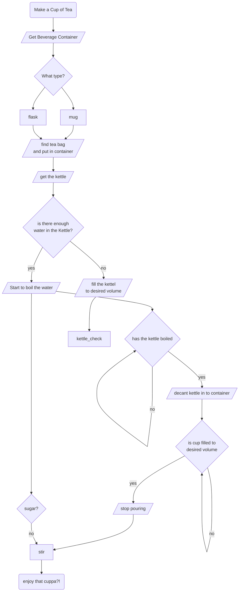
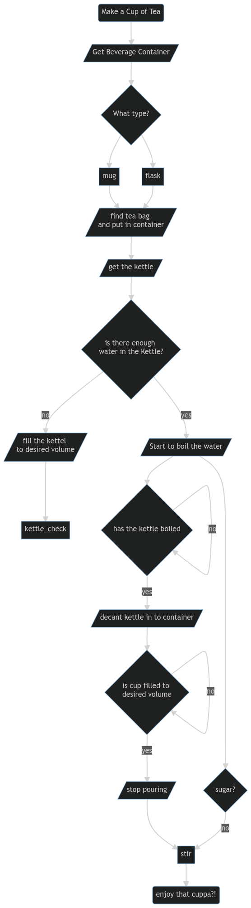

# Flow Charts and Diagrams

In this lab you are going practice building flow charts and diagrams as a way to map how an alogrithm will work. 

You will need to navigate to [https://mermaid-js.github.io/mermaid/#/](https://mermaid-js.github.io/mermaid/#/) to complete this lab.

> **Note:**
>  - Remember to refer to documentation of a tool you are using to understand how to use it...
>  - [https://mermaid-js.github.io/mermaid/#/flowchart](https://mermaid-js.github.io/mermaid/#/flowchart)

## 1. Design an alogrithm or flow process for making a hot drink

**The Code**

**The Output**

