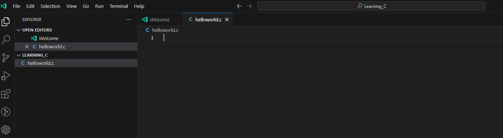
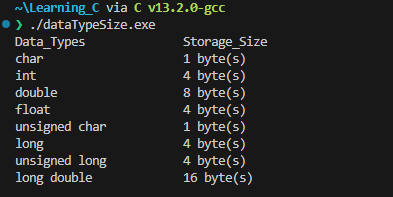

# Lab 1: Learning C

We will be doing this lab inconjuction with the C lecture. Key concepts will be explained and you will put into practice.


## 0. Compiler for C

- We need add a compiler to out `PATH` to do that revist the `~/.bashrc` file and append the `PATH` environment variable the following: 

    ```sh
    $ vim ~/.bashrc
    export PATH=$PATH:"/c/Program Files/GCC-Windows-MingW-2.0.0/w64devkit/bin"
    ```
    >**Note:**
    >> - This collection of build tools are from [https://github.com/skeeto/w64devkit/releases](https://github.com/skeeto/w64devkit/releases)
    >> - and only for our machines in Nelson 128 and Nelson 108, you can download and install using the release and then do the export above.

- Then source the `~/.bashrc` or use the alias we created last time `refresh`

    ```sh
    $ source ~/.bashrc
    ```
    or
    ```sh
    $ refersh
    ```

- The following packages are now available:

    

So let's make our first program.
## 1. Create a Project in Visual Studio:

- Open Visual Studio Code and create a new folder called `Learning_C`..
- Create a new file named `helloworld.c` inside the `Learning_C` directory.

    <div align=center>

    

    </div>

- Then open the file and edit:

    ```c
    #include <stdio.h> // we need this library to get access to the input and out put methods for printing to terminal

    int main()
    {
        printf("Hello World\n"); // lets say hello, where it all began...
        
        printf("Goodbye World\n"); // this seems fitting as the program will close after this.
        
        return 0; // returns 0 to the int of main() and terminate the program
    }
    ```

    Some explanation about the above code:

    - All code gets executed inside of `main()`, 

    - For the program to terminate the `main()` has to have a returnable value, `int`, 

    - The keyword at the end of the `main()` is `return`, this is will return the value preceeding it, 

    - A `0` execute means no errors. >

    - Similar to `C#` to use libraries `c` programs import with the `#include` keyword instead of `using`. 

    - The included library is the standard input out header, `stdio.h`.  

    - By including this header file we have access to the `printf()` function that enables us to return information to the terminal in string format.

    Now we are going to compile the code so that we have an executable file that can be run from the terminal, using the `gcc` compiler:

    ```sh
    $ gcc helloworld.c -o helloworld.exe
    ```

    >**Note:** 
    >> - You can open the terminal in visual studio code using <kbd>ctrl</kbd>+<kbd>shift</kbd>+<kbd>'</kbd>
    >> - If you do not have bash as the default, you can select it from the drop down arrow, like below.
        
    ----

    <details>
    <summary><b>Click for Expected Output</b></summary>
    <p></p>

    

    Congratulations, [you used the programming language of the gods!](https://devhumor.com/media/god-s-programming-language)

    </details>

    ----

## 2. Data Type: Printing Integer

- Now we are going to create a new program called `inputoutput.c` to look like below:

    ```c
    #include <stdio.h>
    int main()
    {
        int testInteger = 5;
        printf("Number = %d", testInteger);
        return 0;
    }
    ```

- Now we are going to compile the code so that we have an executable file that can be run from the terminal, using the `gcc` compiler: 
 
    <div align=center>

    

    </div>

    - We use `%d` format specifier to print `int` types. Here, the `%d` inside the quotations will be replaced by the value of `testInteger`.

    - Changing `%d` to other specifiers will cause the compiler to interpret the variable differently.

## 3. Data Types: Printing Float and Double

- Modify the same file again to look like below:

    ```c
    #include <stdio.h>
    int main()
    {
        ...

        float number1 = 13.5;
        double number2 = 12.4;

        printf("number1 = %f\n", number1);
        printf("number2 = %lf", number2);

        return 0;
    }
    ```
    - `...` means compressed code for brevity, don't write it.

- Run the code again and you will see this again...

    <div align=center>

    
    
    </div>

- We need to recompile, `gcc`, and rerun:

     <div align=center>

    

    </div>

    - To print float, we use `%f` format specifier. Similarly, we use `%lf` to print double values.


## 4. Data Types: Printing Characters

- Modify the same file again to look like below:

    ```c
    #include <stdio.h>
    int main()
    {
        ...

        char chr = 'a';    
        printf("character = %c, value is = %d", chr, chr);  
        return 0;
    } 
    ```
- Run the program again and you should see the following ouput:

    <div align=center>  

    

    </div>

    - To print `char`, we use `%c` format specifier.
    - Every `char` has a numerial representation in ASCII, using `%d` we can get the numerical value.


## 5. User Input in C

In C programming, `scanf()` is one of the commonly used function to take input from the user. The `scanf()` function reads formatted input from the standard input such as keyboards.

- Again we will modify the program to look like the code below:

    ```c
    #include <stdio.h>
    int main()
    {
        ... 
        printf("character = %c, value is = %d\n", chr, chr); // not the \n for newline

        testInteger;
        printf("Enter an integer: ");
        scanf("%d", &testInteger);  
        printf("Number = %d",testInteger);
        return 0;
    }
    ```

- Run the program to get the following output, respond to the prompt and type in a number:
    
    <div align=center>

    

    </div>

    - Here, we have used `%d` format specifier inside the `scanf()` function to take `int` input from the user. When the user enters an integer, it is stored in the `testInteger` variable.

    > Notice, that we have used `&testInteger` inside `scanf()`. It is because `&testInteger` gets the address of `testInteger`, and the value entered by the user is stored in that address. We will cover addressing and pointers at a later date.

---

## 6. Format Specifiers

Here is a table of possible format specifiers for input and output:

|Data Type|	Format Specifier|
|---|---|
|`int`	|`%d`|
|`char`	|`%c`|
|`float`	|`%f`|
|`double`	|`%lf`|
|`short int`	|`%hd`|
|`unsigned int`	|`%u`|
|`long int`	|`%li`|
|`long long int`	|`%lli`|
|`unsigned long int`	|`%lu`|
|`unsigned long long int`	|`%llu`|
|`signed char`	|`%c`|
|`unsigned char`	|`%c`|
|`long double`	|`%Lf`|

---


## 7. Data Types

- Create a new file with called `dataTypeSize.c`

- We are going to write a program that returns the size of each data type availabe in `c`, modify the program to look like below:

    ```c
    #include<stdio.h>
    int main(){

        printf("Data_Types\t\tStorage_Size \n");
        printf("char\t\t\t%d byte(s) \n", sizeof(char));
        printf("int\t\t\t%d byte(s) \n", sizeof(int));
        printf("double\t\t\t%d byte(s) \n", sizeof(double));
        printf("float\t\t\t%d byte(s) \n", sizeof(float));
        printf("unsigned char\t\t%ld byte(s) \n", sizeof(unsigned char));
        printf("long\t\t\t%d byte(s) \n", sizeof(long));
        printf("unsigned long\t\t%ld byte(s) \n", sizeof(unsigned long));
        printf("long double\t\t%ld byte(s) \n", sizeof(long double));

        return 0;
    }
    ```

- Run program to see the data types and there available sizes in bytes: 
    

## 8. Conditions in C (If-Statement)

### Basic if statement

In C, the `if` statement is a fundamental control structure that allows you to make decisions based on certain conditions. It enables you to execute different blocks of code based on whether a condition is `true` or `false`.

### Create a C Program
1. Create a new C file using a text editor like `nano`:

    ```c
    $ nano IfStatement.c
    ```
2. Write a program that applies the `if` statement in C to check `if` the variable `num` is greater than 5 using an `if` statement. If the condition is `true`, the code inside the `if` block is executed, and it prints a message.

    ```c
    #include <stdio.h>

    int main() {
        int num = 10;

        if (num > 5) {
            printf("The number is greater than 5.\n");
        }

        return 0;
    }
    ```

3. Save the file and exit the text editor.

4. Compile your C code using the `gcc` compiler to generate an executable file:
    ```sh
    $ gcc IfStatement.c -o IfStatement.exe
    ```

5. Run your C program using the generated executable file:

    ```sh
    $ ./IfStatement.exe
    ```

This program will output "The number is greater than 5" because the condition `num > 5` is `true`.


### If-else statement

You can use an `if-else` statement to execute different code blocks for true and false conditions. Update your code as follows:

```c
#include <stdio.h>

int main() {
    int num = 3;

    if (num > 5) {
        printf("The number is greater than 5.\n");
    } else {
        printf("The number is not greater than 5.\n");
    }

    return 0;
}
```

### If-else if statement

You can use the `if-else if` statement to handle multiple conditions. Update your code as follows:

```c
#include <stdio.h>

int main() {
    int num = 0;

    if (num > 0) {
        printf("The number is positive.\n");
    } else if (num < 0) {
        printf("The number is negative.\n");
    } else {
        printf("The number is zero.\n");
    }

    return 0;
}
```

## Exersices

### Exercise-1: Even or Odd
Create a program that checks whether a given integer is even or odd. Prompt the user to enter an integer, and then display a message indicating whether it's even or odd.

```c
#include <stdio.h>

int main() {
    int num;

    printf("Enter an integer: ");
    scanf("%d", &num);

    if (num % 2 == 0) {
        printf("%d is even.\n", num);
    } else {
        printf("%d is odd.\n", num);
    }

    return 0;
}
```

### Exercise-2 Prime Number Checker
Write a program that determines if a given number is prime or not.

> **Note:**
>> - A prime number is a natural number greater than 1 that cannot be formed by multiplying two smaller natural numbers. In other words, a prime number has only two positive divisors: 1 and itself. For example, the first few prime numbers are 2, 3, 5, 7, 11, 13, 17, and so on. These numbers are only divisible evenly by 1 and the number itself.

```c

#include <stdio.h>

int is_prime(int number) {
    if (number < 2) {
        return 0; // False
    }
    for (int i = 2; i * i <= number; i++) {
        if (number % i == 0) {
            return 0; // False
        }
    }
    return 1; // True
}

int main() {
    int num;

    printf("Enter a number: ");
    scanf("%d", &num);

    if (is_prime(num)) {// calling the function above.
        printf("%d is a prime number.\n", num);
    } else {
        printf("%d is not a prime number.\n", num);
    }

    return 0; 
}
```

### Exercise-3 : Simple Calculator
Write a basic calculator program that allows the user to perform addition, subtraction, multiplication, and division on two numbers. Ask the user to enter the operation they want to perform and the numbers to operate on.

```c
#include <stdio.h>

int main() {
    char operation;
    double num1, num2, result;

    printf("Enter operation (+, -, *, /): ");
    scanf(" %c", &operation);

    printf("Enter first number: ");
    scanf("%lf", &num1);

    printf("Enter second number: ");
    scanf("%lf", &num2);

    if (operation == '+') {
        result = num1 + num2;
    } else if (operation == '-') {
        result = num1 - num2;
    } else if (operation == '*') {
        result = num1 * num2;
    } else if (operation == '/') {
        if (num2 != 0) {
            result = num1 / num2;
        } else {
            printf("Cannot divide by zero. Please enter a non-zero second number.\n");
            return 1; // Return an error code
        }
    } else {
        printf("Invalid operation. Please choose +, -, *, or /.\n");
        return 1; // Return an error code
    }

    printf("Result: %lf\n", result);

    return 0; 
```