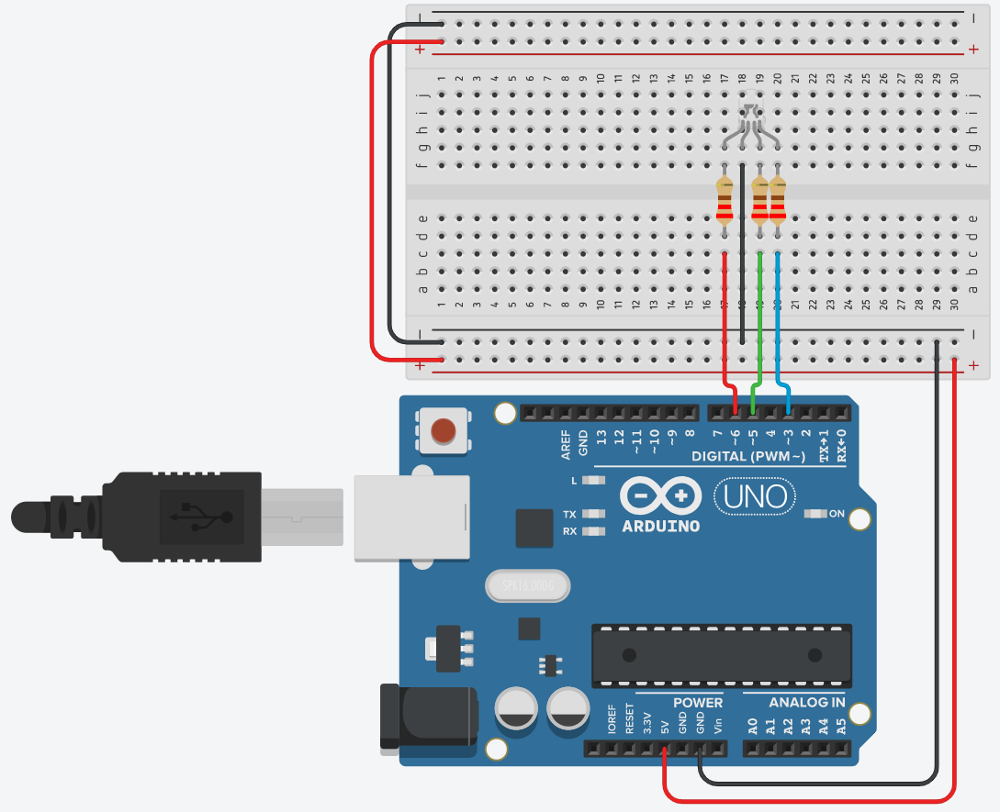

# Multi Coloured LED

## 1 Introduction 

In today’s activity we will use an Arduino with and RGB LED to create a range of colours by using different PWM values via code.

> The primary tool for this project will be TinkerCad -> https://www.tinkercad.com
-------------------

## 2 Circuit

Reproduce the following ciruit, using a cathode RGB LED and 3x 220 \\(\Omega\\) resistors.



## 3 Code

Now you need to reporduce the following code:


```c++
// Define Pins
#define bluePin 3
#define greenPin 5
#define redPin 6

void setup()
{ // setting the three defined pins as output
  pinMode(redPin, OUTPUT);
  pinMode(greenPin, OUTPUT);
  pinMode(bluePin,OUTPUT);
  // setting the pins to be Red On, green and blue Off
  digitalWrite(redPin, HIGH);
  digitalWrite(greenPin, LOW);
  digitalWrite(bluePin, LOW);
}

void loop()
{
  setColour(255, 0, 0);  // red
  delay(1000); // wait a second
  setColour(0, 255, 0);  // green
  delay(1000);
  setColour(0, 0, 255);  // blue
  delay(1000);
  setColour(255, 255, 0);  // yellow
  delay(1000);  
  setColour(80, 0, 80);  // purple
  delay(1000);
  setColour(0, 255, 255);  // aqua
  delay(1000);
}

// takes three integers, for red, green and blue uses 
// the analogWrite function on each pin to change the colour based
// on those supplied values.
void setColour(int red, int green, int blue)
{
  analogWrite(redPin, red);
  analogWrite(greenPin, green);
  analogWrite(bluePin, blue);  
}
```

Run the code see how the RGB transistions between different colours. 

You can change the colour of the LED by setting the values of `setColour(int red, int green, int blue)` ie `setColour(10,50,200)` and see what produces. Remember **Only** the code in the `void loop(){...}` happens continously so this where you'd add extra colours. 

Consider modifying the `delay()` arguments to see if you can get different speeds. `delay(1000)` is one second, `delay(10)` is 0.010 seconds and so on.

